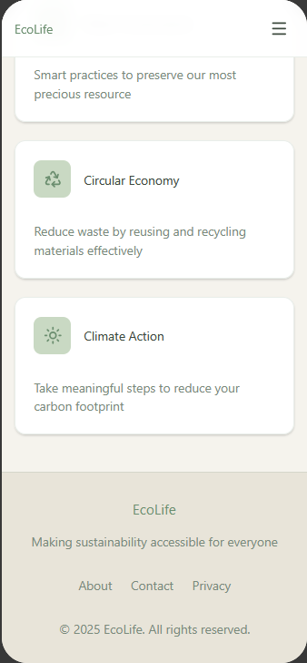

# Climate-Crisis-onepage
  
This is a one-page website demonstrating HTML and CSS techniques in a group setting. The topic for this site was centered on a technology introduced at the Sumitomo Pavilion from the recent World Expo hosted in Osaka. Ian presented the idea of selecting a topic from the World Expo after attending, and Jacob selected the technology to build the website on from the event.

This project is built entirely **without JavaScript**. All layout, animation, and interactivity are handled by pure CSS.

## Design and Planning
 
The initial design was inspired by Ian's personal project as well as [Carrd.co](https://carrd.co/) to guide the wireframes made via Figma. Because the topic would cover scientific topics, we concluded that a simplistic design would help make the information easier to digest for the average visitor. Additionally, this consideration was applied to the color palette, which was chosen to match the green and natural tones people psychologically associate with sustainability and reduced carbon emissions.

### Wireframes

 The design process began with these drafts to map out the user experience and component placement.

  
   
  <em>Draft design of mobile view for top half of web page</em>

  
   
  <em>Draft design of mobile view for the bottom half of web page</em>

  
   
  <em>Draft design of desktop view of web page</em>

## How It Works: Key Features
 
This project showcases several modern CSS techniques to create a dynamic user experience.

### 1. Sticky Stacking Cards

The core informational cards use a "sticky stacking" effect. As our project guidelines called for a sticky navbar, this principle was extended to the informational cards. As the user scrolls, each card will lock in place and allow the next card to slide over it, creating a smooth, "fanned file" effect.

This is achieved by:
- A parent `.stacking-container` to establish a bounding box for the effect.
- Giving each card a `position: sticky` property, which tells it to lock to the viewport once a certain `top` offset is reached.
- Each card has an increasing `z-index` value (`1`, `2`, `3`) to establish a priority order for a proper stack.
- Each card is given a different `top` value (e.g., `70px`, `155px`, `240px`) to create the "fanned file" look. Because headers were single-line and matching font sizes, the `top` value evenly increments by `85px`.

### 2. Responsive Hero Image

The main hero section features text overlaid on a background image. This is achieved using a CSS `::before` pseudo-element on the `.hero-main` container. This pseudo-element creates a semi-transparent overlay (`background: rgba(0, 0, 0, 0.5);`) that sits between the background image and the text, ensuring text readability and high contrast.

### 3. Responsive Navigation

The site header features a responsive navigation menu that transforms into a "hamburger" icon on mobile. This is achieved **without JavaScript** using the "checkbox hack."
- A hidden `<input type="checkbox" id="menu-toggle">` is placed in the HTML.
- The "hamburger" icon is a `<label>` element associated with that checkbox.
- When the user clicks the label, it toggles the checkbox's `:checked` state. We use the **adjacent sibling selector (`+`)** and the `:checked` pseudo-class to show the nav: `#menu-toggle:checked + .site-header .nav`.

### 4. Pure CSS Slider

The content slider is also a pure-CSS component, handled using the "radio button hack."
- A set of hidden `<input type="radio">` buttons controls which slide is active.
- The navigation arrows and dots are `<label>`s that point to the different radio button IDs.
- Using the **general sibling combinator (`~`)** and the `:checked` pseudo-class, the CSS shows only the slide that corresponds to the selected radio button (e.g., `#s1:checked ~ .frame .slide:nth-child(1)`).

### 5. CSS Variable Design System

The entire site's look and feel is controlled by CSS Custom Properties (variables) defined in the `:root` block. This creates a centralized design system, making it easy to maintain a consistent color palette, shadow depth, and border-radius across all components (e.g., `var(--softgreen)`, `var(--radius)`).

## How to View

You can view the live site here: [https://climate-crisis-4w09.onrender.com/](https://climate-crisis-4w09.onrender.com/)

## Technologies Used

- **HTML5:** For semantic page structure.
- **CSS3:** For all styling, layout (Flexbox), and interactivity as outlined above.

We hope you enjoy this project! This was fun to design, put together, and troubleshoot!
